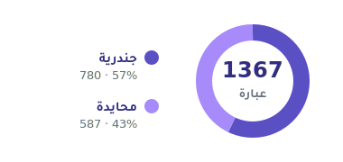

[English](./README.md) | **العربية**

# خِطاب | khitab

[](https://opensource.org/licenses/MIT)
[](https://github.com/ahmedalmnsour/khitab/actions/workflows/ci.yml)
[](https://www.typescriptlang.org/)
[](https://github.com/ahmedalmnsour/khitab)

> عباراتٌ عربية جاهزة تراعي جنس المخاطَب في نصوص الواجهات. خفيفة، مبنية على TypeScript، ومستقلة عن أُطُر العمل.

---

## ما هو خِطاب khitab؟ والفلسفة من ورائه

في العربية، يتغيّر الفعل وكثيرٌ من الجُمل بحسب من تُخاطِب: تقول للرجل `احفظ` وللمرأة `احفظي`، وللرجل `أهلاً بعودتكَ` وللمرأة `أهلاً بعودتكِ`. أغلب الواجهات تتجاهل هذا الفرق وتلجأ إلى المذكّر افتراضياً، فتُخاطِب نصفَ مستخدميها بصيغةٍ لا تخصّهم.

**خِطاب** مكتبة صغيرة: قاموسٌ من العبارات العربية المراجَعة، ودالةٌ صغيرة تُعيد الصيغة الصحيحة بحسب الجنس. الهدف بسيط ومحدَّد: أن تُخاطِب واجهتُك كلَّ مستخدمٍ بالصيغة التي تليق به، دون أن تكتب أنت جداول التصريف يدوياً في كل مشروع.

<p align="center">
  
</p>

الفلسفة التي تحكم المشروع:

- **المخاطبة الصحيحة حقٌّ لا تحسين.** أن يُخاطَب المستخدم بصيغته ليس رفاهية تجميلية، بل احترامٌ أساسي للغة وللشخص.
- **الصدق حول الحدود.** المكتبة تحلّ جزءاً محدوداً من مشكلةٍ لغوية واسعة. لا ندّعي تغطيةً كاملة، ونوثّق ما لا نفعله بوضوح (انظر «حدود المكتبة»).
- **المذكّر ليس محايداً.** اللجوء إلى المذكّر عند الجهل بالجنس حلٌّ عمليٌّ مؤقّت، لا قاعدة صحيحة. نسعى لتقليله كلما سمحت اللغة بصيغةٍ محايدة فعلاً.
- **اللغة قبل الكود.** أُثَمِّن المساهمة اللغوية أكثر من غيرها؛ القاموس يُبنى بمراجعة لغوية لا بكثرة الالتزامات.
- **البساطة عقد.** السطح العام صغير ومقصود: دالتان وأربعة أنواع. كل إضافة تُوزَن بميزان الحاجة لا الإمكان.
- **الشفافية في المراحل.** هذا إصدار alpha (غير منشور على npm بعد): القاموس مكتمل ومراجَع، لكن المكتبة لم تُختبَر ميدانياً بعد، ونقولها صراحةً بدل أن نوهم باكتمالٍ لم يتحقّق.

---

## التثبيت

```bash
npm install @khitab/core
```

المكتبة بلا أي اعتمادات وقت التشغيل (zero runtime dependencies)، وتأتي بصيغتَي ESM وCJS مع تعريفات أنواع كاملة.

---

## البدء السريع

```ts
import { khitab, createKhitab } from '@khitab/core';

// الواجهة البسيطة: عديمة الحالة، الجنس إلزامي.
khitab('save', 'male'); //   احفظ
khitab('save', 'female'); // احفظي

// الواجهة المتقدمة (Factory): نطاق محلي فقط.
const k = createKhitab({ defaultGender: 'female' });
k('login'); // سجّلي الدخول
```

---

## الواجهتان

### 1) الواجهة البسيطة: `khitab(key, gender)`

عديمة الحالة (stateless)، والجنس **إلزامي** في كل استدعاء. لا تحتفظ بأي حالة بين الاستدعاءات، فهي **الموصى بها للسيرفرات** ولأي سياقٍ يُخدَم فيه أكثر من مستخدم.

```ts
khitab('delete', 'male'); //   احذف
khitab('delete', 'female'); // احذفي
```

### 2) الواجهة المتقدمة: `createKhitab(options)`

تُنشئ دالةً مُهيّأة مسبقاً بجنسٍ افتراضي وسلوكٍ محدَّد. **للنطاق المحلي فقط**، داخل مكوِّن (component) أو معالِج طلب واحد.

```ts
const k = createKhitab({
  defaultGender: 'female', // الجنس الافتراضي حين لا يُمرَّر
  mode: 'lenient',         // 'lenient' (افتراضي) أو 'strict'
  onMissingNeutral: 'male' // سلوك غياب المحايد: 'male' (افتراضي) أو 'throw'
});

k('save');         // يستخدم الافتراضي → احفظي
k('save', 'male'); // تمرير صريح يتجاوز الافتراضي → احفظ
```

الخيارات الثلاثة كلها اختيارية، وافتراضاتها: `mode: 'lenient'`، `onMissingNeutral: 'male'`، وبلا جنسٍ افتراضي (فيلجأ إلى `male` عند عدم التمرير).

---

## شفافية حول الحدود: المحايد والمذكّر الافتراضي

هذه أهم نقطة يجب أن تفهمها قبل الاعتماد على المكتبة، ونقولها بصراحة:

القاموس فيه نوعان من العبارات:

1. **عبارات جندرية** (780 عبارة): تحمل `male` و`female`، وكثيرٌ منها يحمل أيضاً صيغة `neutral` مصدرية حين يكون لفعل الأمر مصدرٌ محايد طبيعي (مثل `save`: `احفظ`/`احفظي`/`الحفظ`). أمّا الجُمل الخبرية والماضية المخاطِبة فلا تحمل `neutral`، لأنه لا يكون لها مصدرٌ محايد صادق.
2. **عبارات محايدة طبيعياً** (587 عبارة): تحمل `neutral` وحدها، لأن نصّها لا يخاطب بجنسٍ أصلاً، مثل:

```ts
khitab('tryLater', 'male');   // يُرجى المحاولة لاحقاً
khitab('tryLater', 'female'); // يُرجى المحاولة لاحقاً  (النصّ نفسه، لا فرق)
```

**فماذا يحدث إن طلبتَ `neutral` لعبارةٍ جندرية؟** بما أنها لا تملك صيغةً محايدة، يعتمد السلوك على الوضع:

```ts
// الوضع المتساهل (lenient، الافتراضي): يلجأ إلى المذكّر مع تحذير في الطرفية.
khitab('save', 'neutral');
// → احفظ
// ⚠️ khitab: phrase "save" has no neutral form; falling back to male.

// الوضع الصارم (strict): يرمي خطأً صريحاً بدل اللجوء الصامت.
const strict = createKhitab({ mode: 'strict' });
strict('save', 'neutral');
// ✗ Error: khitab: phrase "save" has no neutral form (strict mode).
```

اللجوء إلى المذكّر هنا حلٌّ **عمليٌّ لا مثاليّ**، ونحن صادقون في تسميته كذلك. الصيغة المحايدة **ممكنة نظرياً** لكثيرٍ من العبارات (بإعادة صياغةٍ مبنيّة للمجهول أو مصدرية)، لكنها تحتاج عملاً لغوياً ومراجعة. **هنا يأتي دورك:** انظر «للشمولية الكاملة» و«المساهمة».

---

## ⚠️ تحذير: العرض من جانب الخادم (SSR)

لا تُنشئ Factory في النطاق العام (global scope) على الخادم. الدالة الناتجة من `createKhitab` تحمل حالةً (الجنس الافتراضي والإعدادات). إن وُضعت في مستوى الوحدة (module-level) على سيرفر، يؤدي ذلك إلى **تسرّب الحالة** بين طلبات المستخدمين، فيرى مستخدمٌ صيغةً هُيّئت لطلب مستخدمٍ آخر.

القاعدة:

```ts
// ✗ خطأ على الخادم: حالة مشتركة بين كل الطلبات.
const k = createKhitab({ defaultGender: 'female' });
export function handler(req) { return k('save'); }

// ✓ صحيح: إمّا الواجهة البسيطة عديمة الحالة...
export function handler(req) { return khitab('save', req.user.gender); }

// ✓ ...أو Factory داخل نطاق الطلب الواحد.
export function handler(req) {
  const k = createKhitab({ defaultGender: req.user.gender });
  return k('save');
}
```

على العميل (متصفّح، أو مكوِّن واجهة لمستخدمٍ واحد) فإنشاء Factory محلي آمن.

---

## ⚠️ تحذير: إصدار alpha

هذا إصدار **alpha، غير منشور على npm بعد**: القاموس مكتمل ومراجَع، لكن المكتبة لم تُختبَر بعد في مشاريع حقيقية. قد تتغيّر الواجهة العامة (الدوال والأنواع) وقد يتغيّر القاموس (نصوص، إضافات، أسماء مفاتيح) بصورةٍ **غير متوافقة مع السابق** قبل الإصدار المستقر `1.0.0`. إن اعتمدتَ عليه في الإنتاج، **ثبّت إصدارك** (pin) وراجع [سجل التغييرات](./CHANGELOG.md) قبل الترقية.

---

## حدود المكتبة

لنكون صادقين معك، هذا ما **لا** تفعله المكتبة حالياً:

- **لا تكتشف الجنس.** أنت تُمرّره؛ المكتبة لا تخمّنه من اسمٍ ولا من سياق.
- **لا تصرّف نصوصاً حرّة.** تُعيد عباراتٍ من قاموسٍ مُعدّ مسبقاً فقط، لا تُصرّف جملةً تكتبها أنت لحظياً.
- **لا تغطّي كل التراكيب.** النطاق الحالي: الأمر، جمل الاستفهام، الصياغات المهذّبة، والفعل الماضي مع «لقد» مسنَداً إلى ضمير المخاطب. المؤجَّل: الجُمَل ذات الإسناد المركّب (ضمائر متعددة)، والمستقبلية المعقّدة، والمبني للمجهول الكامل (عدا المحايدة الموثّقة)، واللهجات.
- **لا تدعم المثنّى ولا الجمع** كصِيَغ مخاطبة في هذا الإصدار.
- **لا محايدَ لكل عبارة جندرية.** نضيف `neutral` حيث يكون لفعل الأمر مصدرٌ محايد صادق فقط؛ والجُمل الخبرية والماضية تبقى جندرية بلا محايد (كما شُرح أعلاه).

نوثّق هذه الحدود عمداً: مكتبةٌ صادقةٌ بحدودها أنفعُ من واحدةٍ تَعِد بما لا تفي به.

---

## للشمولية الكاملة

اللجوء إلى المذكّر افتراضياً ليس غايتنا، بل نقطة انطلاق. الطريق نحو شموليةٍ أكمل:

- **أضف صيغاً محايدة** للعبارات الجندرية حيث تسمح اللغة (إعادة صياغة مبنيّة للمجهول أو مصدرية). كل صيغةٍ محايدة تُضاف تُقلّل اللجوء إلى المذكّر.
- **استعمل الوضع الصارم** (`mode: 'strict'`) أثناء التطوير لتكتشف مواضع غياب المحايد مبكراً بدل أن تمرّ صامتةً.
- **مرّر الجنس الحقيقي** متى توفّر من بيانات المستخدم، بدل الاتكال على الافتراضي.

المساهمة اللغوية هي المحرّك الأساسي لهذا التقدّم. انظر القسم التالي.

---

## المساهمة

أُثَمِّن المساهمة اللغوية أكثر من غيرها: اقتراح عبارةٍ دقيقة أو إكمال صيغةٍ ناقصة. تفاصيل القواعد وطريقة العمل في [دليل المساهمة](./CONTRIBUTING.md). القاعدة الأهم: **تقترح النصّ والسياق، لا اسم المفتاح** (المفتاح يسكّه صاحب المشروع حفاظاً على عقد القاموس العام).

لاقتراح عبارة، افتح [Issue عبر قالب «اقتراح عبارة»](https://github.com/ahmedalmnsour/khitab/issues/new?template=add-phrase.md).

يلتزم كل المشاركين بـ[قواعد السلوك](./CODE_OF_CONDUCT.md). للإبلاغ عن أي انتهاك، راسِل: **khitab.conduct@gmail.com**.

---

## الترخيص

[MIT](./LICENSE) © 2026 Ahmed Almnsour
